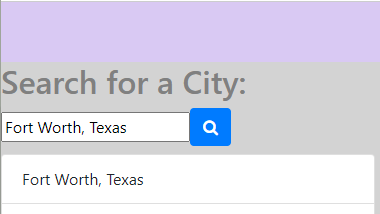
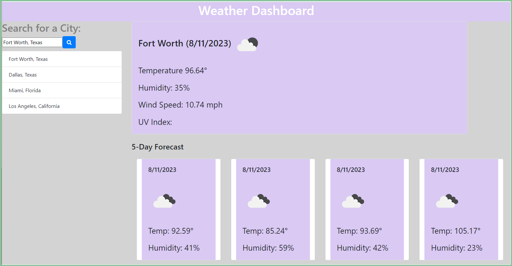
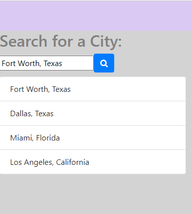

# Weather Page🌤️⛈️

## Overview

The purpose of this site is to provide users with the opportunity to search for weather information in any city and/or state, and it will provide them with a 5-Day upcoming forecast.

## Installation Instructions

Launch website through default browser.

## Website Link

[Deployed WebPage](https://astand02.github.io/weather-page/)

## User Guide

To use this page user must type in the city name and state in the input section to the left of the page. 

Once the user has typed out the desired city, they will need to click on the magnifying glass button, which will allow the browser to show the forecast for that city within the next five days. 

The browser will then save the user's previous searches below the search bar if the user wishes to view another city.

